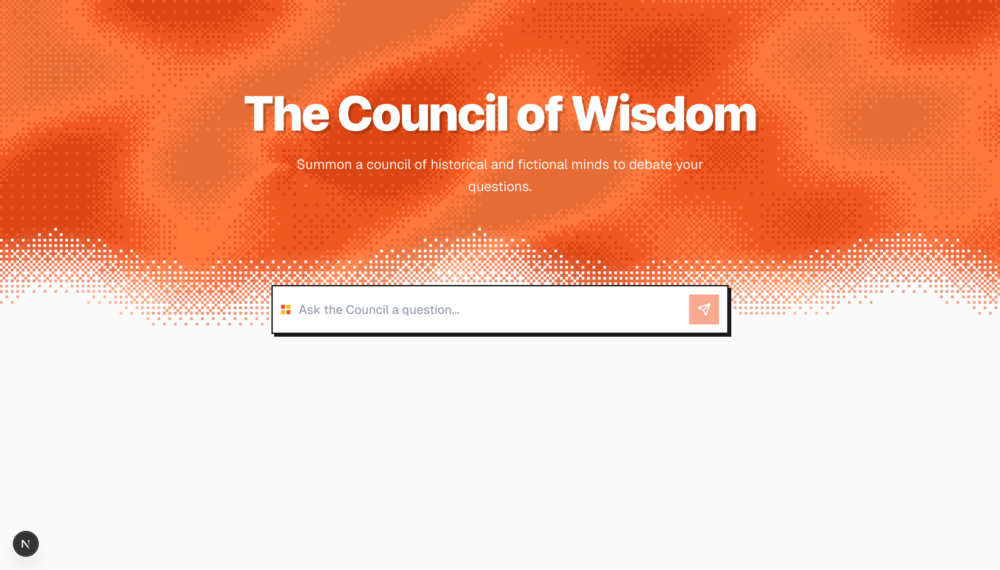
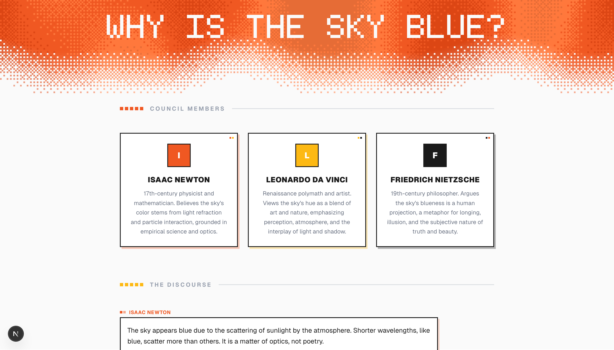
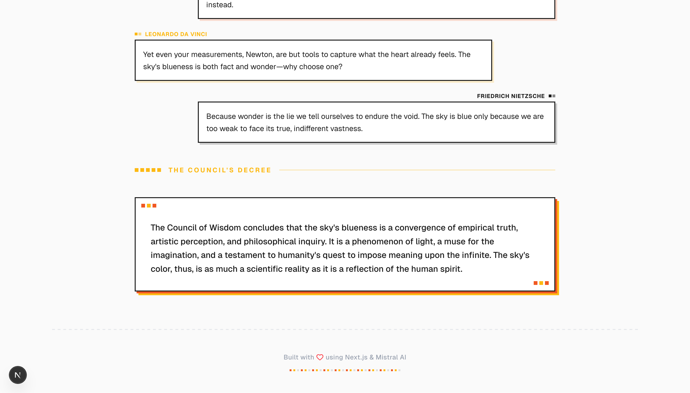

# The Council of Wisdom

A Next.js application powered by Mistral AI that summons a council of historical and fictional figures to debate your questions.

Try it now at [https://mistral-ai-council.vercel.app/](https://mistral-ai-council.vercel.app/)

## 🚀 Getting Started

### Prerequisites

- Node.js 18+ installed.
- A Mistral AI API Key.

### Installation

1.  Install dependencies:
    ```bash
    npm install
    ```

2.  Set up environment variables:
    Create a `.env.local` file in the root directory and add your Mistral API key:
    ```env
    MISTRAL_API_KEY=your_api_key_here
    ```

3.  Run the development server:
    ```bash
    npm run dev
    ```

## Screenshots





